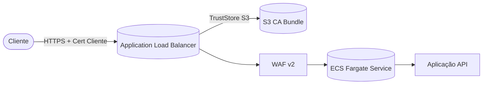

# 🌐 Terraform Infrastructure – API com ALB + mTLS + ECS Fargate + WAF


---

## 📌 Visão Geral

Este repositório contém a implementação de **infraestrutura AWS via Terraform** para hospedar uma **API em ECS Fargate**, protegida por um **Application Load Balancer (ALB)** com **SSL/TLS** e **mTLS** habilitados.

O provisionamento é totalmente automatizado via **GitHub Actions**, garantindo segurança, consistência e reprodutibilidade.

---

## 🏗️ Componentes da Solução

* **Networking** → VPC, subnets públicas/privadas, IGW e rotas.
* **S3 (Truststore mTLS)** → bucket versionado para armazenar certificados de Autoridade (CA).
* **ALB** → balanceador público HTTPS com trust store mTLS integrado ao S3.
* **ECS Fargate** → cluster, tasks e services para rodar containers da API.
* **WAF v2** → firewall integrado ao ALB, bloqueando tráfego malicioso.

---

## 🔐 Fluxo de Segurança



1. O cliente se conecta ao **ALB via HTTPS**.
2. O **ALB valida o certificado do cliente (mTLS)**.
3. O **bundle da CA** está armazenado no **S3 versionado**.
4. Conexões válidas passam pelo **WAF v2**.
5. Somente então chegam ao **ECS Fargate Service**.

---

## 🛠️ Gerando Certificados com OpenSSL

⚠️ Para **homologação/testes**. Em produção, recomenda-se usar **AWS ACM PCA** ou CA corporativa.

### 1. Criar CA Root

```bash
openssl genrsa -out certs/ca.key 4096
openssl req -x509 -new -nodes -key certs/ca.key -sha256 -days 3650 \
  -out certs/ca.crt -subj "/CN=MyRootCA/O=MyOrg/C=BR"
```

### 2. Criar Certificado do Cliente

```bash
openssl genrsa -out certs/client.key 2048
openssl req -new -key certs/client.key -out certs/client.csr \
  -subj "/CN=client1/O=MyOrg/C=BR"
openssl x509 -req -in certs/client.csr -CA certs/ca.crt -CAkey certs/ca.key \
  -CAcreateserial -out certs/client.crt -days 365 -sha256
```

### 3. Gerar Bundle da CA

```bash
cat certs/ca.crt > certs/ca_bundle.pem
```

### 4. Testar Conexão mTLS

```bash
curl -vk https://<ALB_DNS> \
  --cert certs/client.crt \
  --key certs/client.key
```

---

## ⚙️ CI/CD – GitHub Actions

A pipeline em `.github/workflows/terraform.yml` controla todo o ciclo:

### 🔍 PLAN - DEV

Executado em **push para `main`**:

* `terraform init`
* `terraform validate`
* `terraform plan` → gera `plan.dev.out` (salvo como artefato).

### 🚀 APPLY - DEV

Executado **apenas manualmente** (`workflow_dispatch`):

* Baixa `plan.dev.out`.
* Executa `terraform apply -auto-approve`.

🔒 **Segurança extra**: nada é aplicado automaticamente em produção.

---

## ✅ Benefícios

* **Automação completa** com Terraform + GitHub Actions.
* **Segurança reforçada**: mTLS no ALB + WAF integrado.
* **Escalabilidade** com ECS Fargate (serverless containers).
* **Governança**: certificados versionados em S3.
* **Confiabilidade**: plano/aplicação controlados por CI/CD.

---


